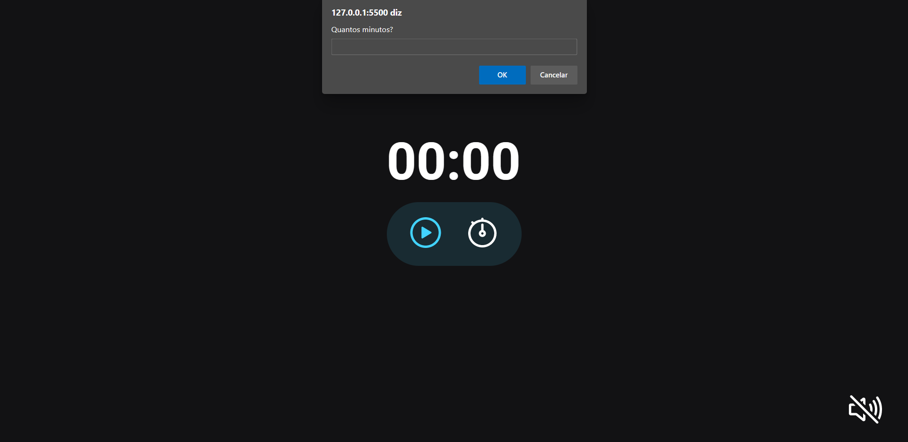

# Projeto Focus Timer | Trilha Explorer

---

## Tecnologias

  

---

## O que aprendi

- Ajustando larguras e tamanhos com CSS clamp
- Alinhando com grid
- DOM do Browser
- Event-driven, programação imperativa e callbacks
- Refatorando para as novas funcionalidades
- Iniciando a lógica para o contador
- Principios de Clean Code e programação declarativa
- Introdução as ES6 Modules
- Criando objetos com padrão Factory e injeção de dependencias
- Adicionando Sons

---

## Contato

<a href = "mailto:probertos717@gmail.com">